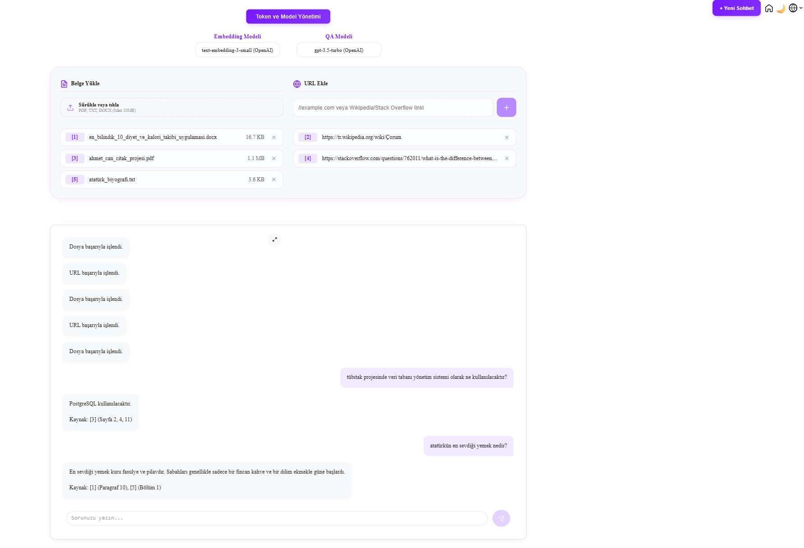
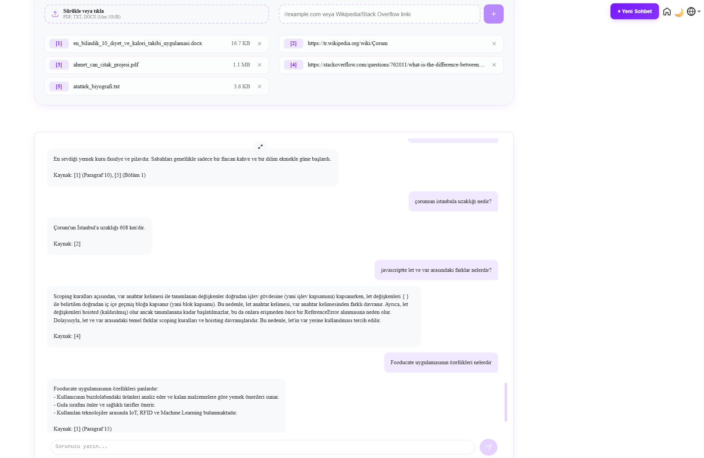

# RAG-Based Question-Answering Assistant

RAG (Retrieval-Augmented Generation) tabanlı soru-cevap asistanı. Yüklediğiniz PDF/metin dosyaları ve eklediğiniz URL’ler (Wikipedia, Stack Overflow) üzerinden soru sorup yalnızca o kaynaklara dayalı cevap alırsınız.

| Ana sayfa | Belge/URL yükleme ve sohbet | Kaynak gösterimli cevaplar |
|-----------|-----------------------------|----------------------------|
|  |  |  |

---

## Öne çıkan özellikler

- **Çoklu kaynak:** PDF, TXT, DOCX yükleme ve Wikipedia / Stack Overflow URL’leri ekleme
- **RAG pipeline:** Metinler parçalara ayrılır, embedding üretilir, pgvector ile semantik arama yapılır
- **Çoklu model:** Sohbet için OpenAI (GPT) veya Gemini; embedding için OpenAI veya Gemini
- **Session tabanlı:** Tarayıcı oturumunda sohbet ve kaynaklar saklanır

---

## Teknoloji yığını

| Katman      | Teknolojiler |
|------------|--------------|
| Backend    | Python, FastAPI, PostgreSQL + pgvector, OpenAI API, Google Gemini |
| Frontend   | React, Vite |
| Embedding  | OpenAI (text-embedding-ada-002, text-embedding-3-small), Gemini (models/gemini-embedding-001) |

---

## Sistem nasıl çalışıyor?

1. **Kaynak girişi:** Kullanıcı PDF/URL ekler.
2. **İşleme:** Metinler chunk’lanır, embedding API ile vektörlere dönüştürülür, pgvector’e yazılır.
3. **Sorgu:** Kullanıcı soru sorar; soru da embed edilir, pgvector’de benzerlik araması yapılır.
4. **Cevap:** En alakalı chunk’lar LLM’e context olarak gönderilir; model yalnızca bu bağlama dayalı cevap üretir.

---

## Proje yapısı

Kod iki ayrı repo’da tutulmaktadır:

| Repo | Açıklama |
|------|----------|
| [**Backend**](https://github.com/AhmetCannnn/answer_question_bot_backend) | FastAPI, pgvector, embedding ve QA API’leri |
| [**Frontend**](https://github.com/AhmetCannnn/answer_question_bot_frontend) | React arayüzü |

---

## Kurulum (yerel)

**Backend**

```bash
git clone https://github.com/AhmetCannnn/answer_question_bot_backend.git
cd answer_question_bot_backend
pip install -r requirements.txt
# .env dosyasını oluşturup DATABASE_URL vb. doldur
# Veritabanı: db/schema.sql ve db/seed_models.sql çalıştır
uvicorn app:app --reload --port 8001
```

**Frontend**

```bash
git clone https://github.com/AhmetCannnn/answer_question_bot_frontend.git
cd answer_question_bot_frontend
npm install
npm run dev
```

Frontend varsayılan olarak `http://localhost:5173`, backend’i `http://localhost:8001` üzerinden kullanır.
